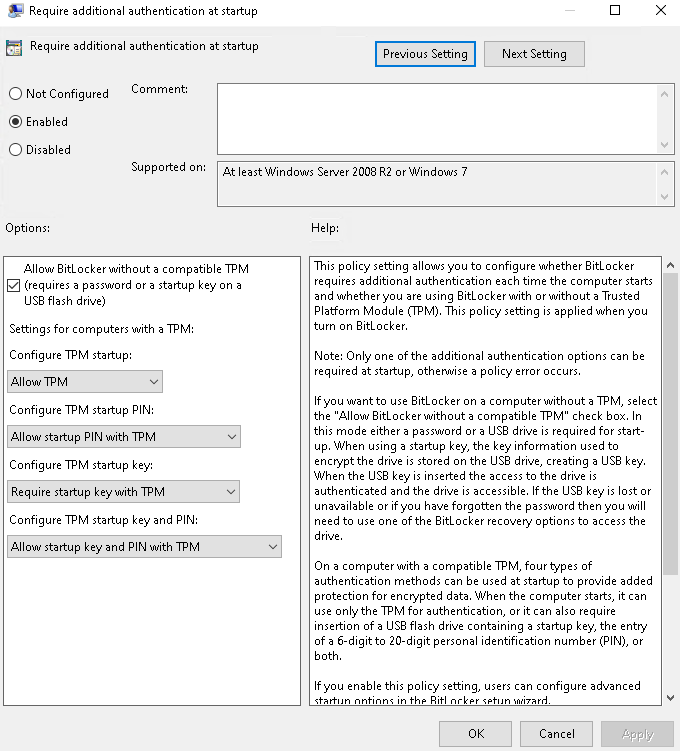

# Full Encryption + USB Key At Boot

Change Local Group Policy Editors Settings

    1. start menu
    2. type: gpedit.msc
    3. right click and open as administrator

Now browse to 

    Administrative Templates 
    '-> Windows Components
      '-> Bitlocker Drive Encryption
        '-> Operating System Drives
         '-> Require Additional Authentication At Startup
          '-> Press enable

### Settings should be set as:

      Configure TPM startup: Allow TPM
      Configure TPM Startup PIN: Allow Startup with TPM
      Conifgure TPM Startup Key. Require startup key with TPM
      Configure TPM startup key and PIN: Allow startup key and PIN with TPM

### Add keys to your USB:

     manage-bde -protectors -add c: -TPMAndStartupKey usb_drive: 

### Delete Old Keys

     manage-bde -protectors -delete c:
